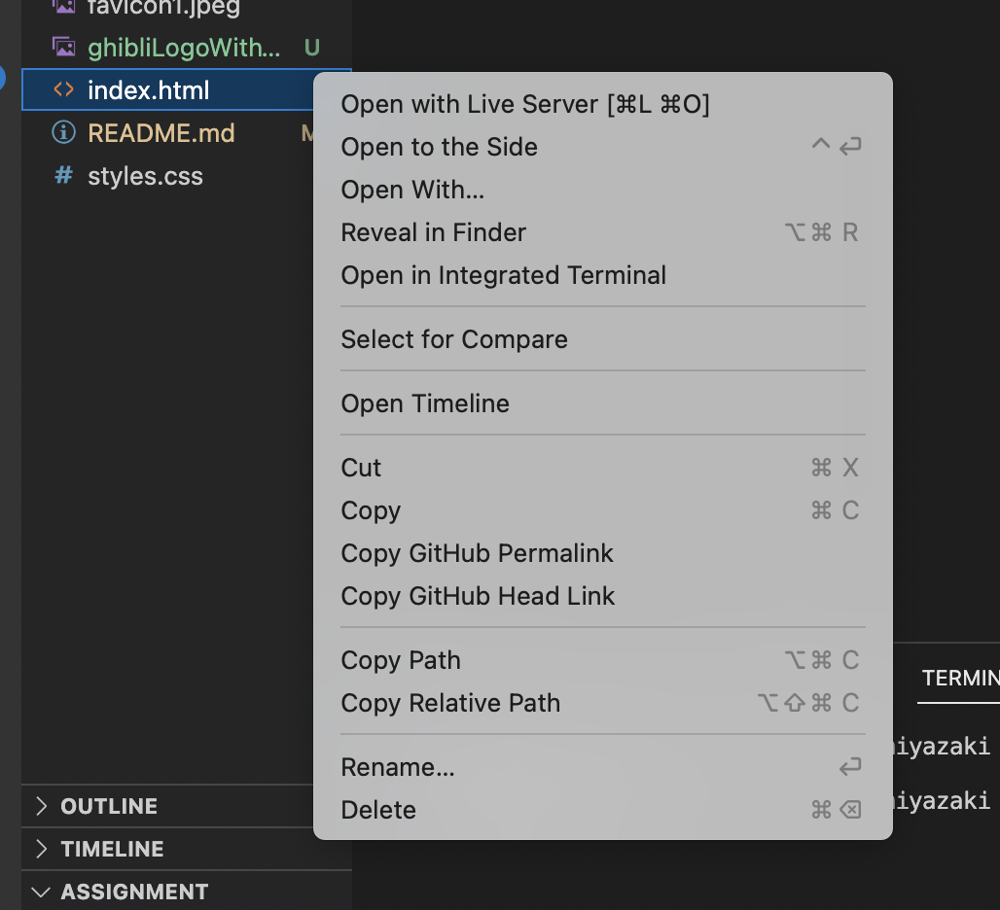

## Index

* [Project Description](#project-description)
* [Retrospect and Future Plans](#retrospect-and-future-plans)
* [Dev Manual](#dev-manual)
* [Support and Feedback](#support-and-feedback)


---
## Project Description
<br/>


This is the first tribute page that I made and I decided to contribute it to my most loved animator Hayao Miyazaki, the Ghibli legend. I spent quite some time to researching all the content on the page but I missed out on all the references. 

The tribute page is built with HTML, a little bit of CSS styling and is deployed via Netlify. 

Feel free to visit the page [here](hayao-miyazaki-ten-hub.netlify.app) or just go on the link down below. 

hayao-miyazaki-ten-hub.netlify.app


<br/>

---


## Retrospect & Future Plans
<br/>


Building a pure HTML page like this really consolidate the HTML basics. Plus, reasearching things you love is just a enjoyable process in general. Definitely would recommend it to anyone who is trying to consolidate their HTML basics as well. 

Future plan:
* Build test for the page. 
<br/>
<br/>

---

## Dev Manual
<br/>

The tribute page is deployed via [Netlify](hayao-miyazaki-ten-hub.netlify.app). But if you would like to run the page locally, just follow the following instructions. 

<br/>


Clone the project via GitHub link. 
```bash
git clone https://github.com/ten-hub/hayao-miyazaki.git
```
<br/>


And simply right click on index.html file to open with Live Server if you have one or just copy path and paste on a browser of your choice to view your page. 



---

## Support and Feedback
<br/>


To give feedback or receive support, please contact me through my email: wantengteoh@gmail.com

<br/>


[--Return to the top](#index)